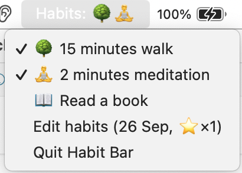

# habit-chart

A simple macOS menubar habit tracking app.

Completing every habit in a day earns you a ⭐️. Likewise, bonus habits earns a ✨.

## habits.yaml file

Run as a Python file or use `python setup.py py2app` to create an app which doesn't appear in the Dock.

Your habits file, `~/.config/habits.yaml`, is automatically set up. Check out `default.yaml` for more info on keys; use the *Edit habits* button to open your habits file to check or change habits, log entries and settings.